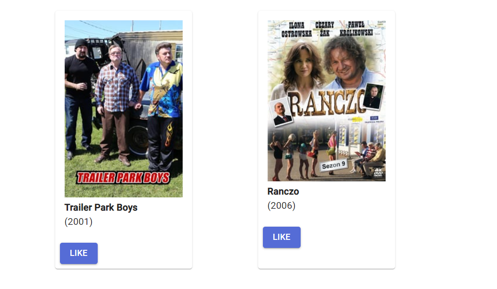

# "Let's Watch It Together" test case report

## Date: \<date of last template update\>

12.01.2021

## General Information

Test Stage|Test Date|Tester|Test Case Description|Results|
-----|-----|-----|-----|-----|
manual|12.01.2021|Jordan Niedzielski|Checking if the posters and titles of shows from imported .csv show list made on [IMDb](https://www.imdb.com)|pass|

## Introduction

1. Setup procedures:
    * log in to the app, using the Github OAuth
    * create and export a list of favourite shows created with [IMDb tool](https://www.imdb.com/list/create) to .csv (spreadsheet) format

2. Stop procedures: n/a

## Enviromental needs

1. Hardware: *Identify the qualities and configurations of the hardware required to execute the test case.*  

2. Software: *Identify the qualities and configurations of the hardware required to execute the test case.*

3. Procedural Requirements:

        * successfully log in to the app
        * add or skip adding friends on the home screen of the app

## Test

1. Test Items and Features: the show list feature of the app

2. Input Specifications: a prepared list of the favourite shows in .csv format

3. Procedural Steps:  

    1. *(optional, yet reccomended)* expand the *"To create an IMDB list"* dropdown list and follow the instructions
    2. find shows of your interest using the search bar:
            * provide title of the shows and click "Add"
    3. scroll below to check if there is a list of components, each consisting of a poster, title and a four digit number, symbolizing the year of show's creation

4. Expected Results of Case: a beautifully looking list of my favourite shows!

## Actual results

